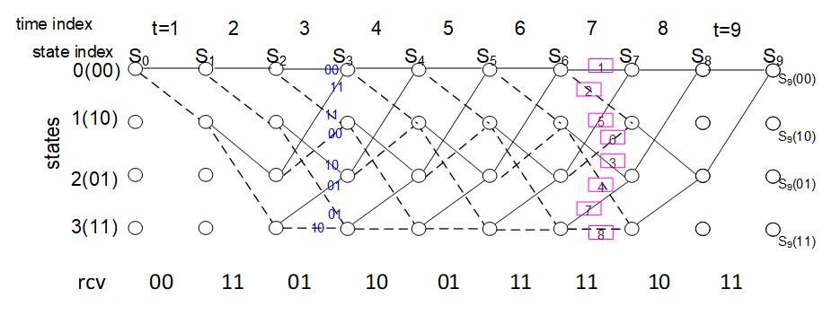
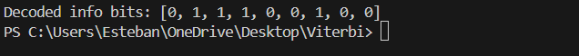
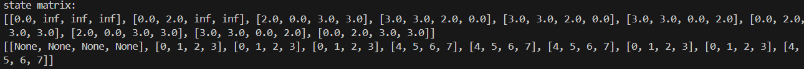
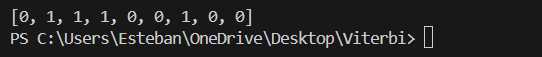
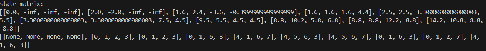
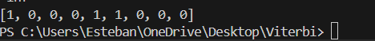
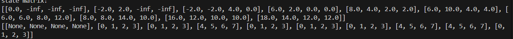

# Lab Report HW #34: Viterbi Decoding

**Course:**  Forward error correction / convolutional coding 
**Student(s):**  Esteban Moroz
**Submission date:**  may 7th 2026

---

## 1. Introduction

The aim of this homework is to understand the viterbi algorithm and create a computer program capable of decoding certain received bits.

For every section a computer program will be used to answer.


---

## HW #34-1

Problem 34-1: G=7|5 non-systematic code receive bits are given by
rcv bit = [00    11     01     10     01     11     11     10     11]. Find optimum receive path (state transition), and information bit by using Viterbi decoding with HD (hamming distance metric) as shown below.






## HW #34-2

G=7|5 non-systematic code receive bits are given by rcv samples are real as rcv = [+1 +1 +0.6 -1 +1-1 -1 -0.1 +1 -1  -1 -1  +0.3  -1  -1 +1   -1 -1]. 
Find optimum receive path (state transition), and information bit by using Viterbi decoding – SD with CM.





## HW #34-3
In Figure 5 (for convenience shown below as well) in the lecture note, where received samples are quantized to +1 when received value is positive and -1 otherwise. And quantized received values are given by
 rcvq = [-1 -1; -1 1; -1 -1; 1 1; -1 -1; 1 -1; 1 -1; -1 -1; 1  1];
Find state metric and corresponding branch metric by using Viterbi decoding. Then transmit bits and information bits.






## Python Implementation #34-4 and #34-5

### 4.1 Source Code for decoder w/o CM

```python
import math

state_metric = [0.0, math.inf, math.inf, math.inf]


branch = [1, 2, 3, 4, 5, 6 , 7]

branch_bit = [0b00, 0b11, 0b10, 0b01, 0b11, 0b00, 0b01, 0b10]

branch_bit_decoded = [0,1,0,1,0,1,0,1]


# dynamic array
def create(size):
    return [None] * size


# input the k + 2 values of the received bits (k = 7, so k + 2 = 9)
n = int(input("how many bits sent?"))


t_array = create(n)

bit_array = create(n)

state_matrix = [[None for _ in range(4)] for _ in range(n + 1)]
branch_matrix = [[None for _ in range(4)] for _ in range(n + 1)]

# info bits received
print("Please, input the received bits (00, 01, 10 o 11):")
for i in range(n):
    while True:
        bits = input(f"Bits in position {i}: ")
        if bits in ['00', '01', '10', '11']:
            bit_array[i] = int(bits, 2)  # Convierte binar00io a decimal
            break
        else:
            print("Please enter only 00, 01, 10 or 11")

print(f"Bits sent: {bit_array}")

# first row of state_matrix: only state '00' (0) has metric 0, the rest are infinity
state_matrix[0]  = [0.0, math.inf, math.inf, math.inf]


def get_msb(value, bits=2):
    """returns the most significant bit (MSB) of a value given the total number of bits."""
    return (value >> (bits - 1)) & 1

def get_lsb(value):

    return value & 1

def bits_str(value, bits=2):
    """returns a string representation of the bits of a value, padded to the specified number of bits."""
    s = format(value, f'0{bits}b')
    return int(s[0]), int(s[1])


for i in range(1, n + 1):
    state_matrix[i] = [math.inf, math.inf, math.inf, math.inf]


def invert_bit(bit):
    """Inverts a single bit (0 to 1, or 1 to 0)."""
    return bit ^ 1


# branch_metric: calculates the Hamming distance between the expected bits for a branch and the received symbol.
def branch_metric(branch_idx, received):
    """Returns the Hamming distance between the expected bits for a branch and the received symbol."""
    expected = branch_bit[branch_idx]  # 2-bit value for the branch
    return bin(expected ^ received).count('1')


state_matrix


print(f"Bits sent: {bit_array}")

# Determine the number of steps to process
steps = min(n, len(bit_array))
if steps != n:
    print(f"Warning: requested n={n} but only {len(bit_array)} symbols available, using steps={steps}")


for i in range(1, steps + 1):
    received = bit_array[i - 1]

    
    state_matrix[i][0] = min(
        state_matrix[i - 1][0] + branch_metric(0, received),  # branch 1
        state_matrix[i - 1][2] + branch_metric(4, received),  # branch 5
    )

    if state_matrix[i - 1][0] + branch_metric(0, received) <= state_matrix[i - 1][2] + branch_metric(4, received):
        branch_matrix[i][0] = 0  # branch 1
    else:
        branch_matrix[i][0] = 4  # branch 5

    state_matrix[i][1] = min(
        state_matrix[i - 1][0] + branch_metric(1, received),  # branch 2
        state_matrix[i - 1][2] + branch_metric(5, received),  # branch 6
    )


    if state_matrix[i - 1][0] + branch_metric(1, received) <= state_matrix[i - 1][2] + branch_metric(5, received):
        branch_matrix[i][1] = 1  # branch 2
    else:
        branch_matrix[i][1] = 5  # branch 6


    
    state_matrix[i][2] = min(
        state_matrix[i - 1][1] + branch_metric(2, received),  # branch 3
        state_matrix[i - 1][3] + branch_metric(6, received),  # branch 7
    )

    if state_matrix[i - 1][1] + branch_metric(2, received) <= state_matrix[i - 1][3] + branch_metric(6, received):
        branch_matrix[i][2] = 2  # branch 3
    else:
        branch_matrix[i][2] = 6  # branch 7

    state_matrix[i][3] = min(
        state_matrix[i - 1][1] + branch_metric(3, received),  # branch 4
        state_matrix[i - 1][3] + branch_metric(7, received),  # branch 8
    )


    if state_matrix[i - 1][1] + branch_metric(3, received) <= state_matrix[i - 1][3] + branch_metric(7, received):
        branch_matrix[i][3] = 3  # branch 4
    else:
        branch_matrix[i][3] = 7  # branch 8
    for j in range(4):
        print(f"state_matrix[{i}][{j}] = {state_matrix[i][j]}")

print(f"state matrix:\n{state_matrix}")

print (branch_matrix)

path = [None] * (steps + 1)
for j in range(n, -1, -1):
    
    candidate = state_matrix[j][0]
    path[j] = 0 
    for i in range(4): 
        print(state_matrix[j][i]) 
        if state_matrix[j][i] <= candidate:
            candidate = state_matrix[j][i]
            path[j] = i  


for j in range(n, -1, -1):
    print (path[j])


info_bits = []  
for i in range(1, steps + 1):
    info_bits.append(branch_bit_decoded[branch_matrix[i][path[i]]]) 


print (f"Decoded info bits: {info_bits}")


```

### 4.2 Source Code for decoder with CM

```python
import math
import random

branch_bit = [0b00, 0b11, 0b10, 0b01, 0b11, 0b00, 0b01, 0b10]

# decoded info bit for each branch
branch_bit_decoded = [0, 1, 0, 1, 0, 1, 0, 1]


def create(size):
    return [None] * size


# Step 2: CM branch metric
# BPSK mapping: bit 0 -> +1, bit 1 -> -1
# metric = s1*r1 + s2*r2   (to be MAXIMIZED)
def cm_branch_metric(branch_idx, r1, r2):
    expected = branch_bit[branch_idx]
    c1 = (expected >> 1) & 1
    c2 =  expected       & 1
    s1 = 1 - 2 * c1   # bit 0 -> +1, bit 1 -> -1
    s2 = 1 - 2 * c2
    return s1 * r1 + s2 * r2


# Step 1: initialize — Problem 34-2 received sequence (rate 1/2, 9 pairs)
# Figure trellis example — received pairs (r1, r2) for each t=1..9
# t:  1        2       3        4         5       6       7       8       9
#rcv = [-1,+0.1, -1,+1, -1,+0.1, -0.2,+1, -1,-1, +1,-1, +1,-1, -1,-1, +1,+1]
rcv = [+1,+1, +0.6,-1, 1,-1, -1,0.1, +1,-1, -1,-1, 0.3,-1, -1,+1, -1,-1]

#rcv= [-1, -1, -1, 1, -1, -1, 1, 1, -1, -1, 1, -1, 1, -1, -1, -1, 1, 1]
r1_array = rcv[0::2]   # even-indexed: first of each pair
r2_array = rcv[1::2]   # odd-indexed:  second of each pair
n = len(r1_array)

state_matrix  = [[None for _ in range(4)] for _ in range(n + 1)]
branch_matrix = [[None for _ in range(4)] for _ in range(n + 1)]

# initialize: only state '00' (index 0) has metric 0, rest are -inf
state_matrix[0] = [0.0, -math.inf, -math.inf, -math.inf]

print(f"n = {n} symbol pairs")
print(f"r1 samples: {r1_array}")
print(f"r2 samples: {r2_array}")

for i in range(1, n + 1):
    state_matrix[i] = [-math.inf] * 4

# Steps 2-5: forward pass
for i in range(1, n + 1):
    r1 = r1_array[i - 1]
    r2 = r2_array[i - 1]

    # state 0: arrives from state 0 (branch 0) or state 2 (branch 4)
    m0 = state_matrix[i - 1][0] + cm_branch_metric(0, r1, r2)
    m4 = state_matrix[i - 1][2] + cm_branch_metric(4, r1, r2)
    state_matrix[i][0] = max(m0, m4)
    if m0 > m4:
        branch_matrix[i][0] = 0
    elif m4 > m0:
        branch_matrix[i][0] = 4
    else:
        branch_matrix[i][0] = random.choice([0, 4])   # tie-break

    # state 1: arrives from state 0 (branch 1) or state 2 (branch 5)
    m1 = state_matrix[i - 1][0] + cm_branch_metric(1, r1, r2)
    m5 = state_matrix[i - 1][2] + cm_branch_metric(5, r1, r2)
    state_matrix[i][1] = max(m1, m5)
    if m1 > m5:
        branch_matrix[i][1] = 1
    elif m5 > m1:
        branch_matrix[i][1] = 5
    else:
        branch_matrix[i][1] = random.choice([1, 5])   # tie-break

    # state 2: arrives from state 1 (branch 2) or state 3 (branch 6)
    m2 = state_matrix[i - 1][1] + cm_branch_metric(2, r1, r2)
    m6 = state_matrix[i - 1][3] + cm_branch_metric(6, r1, r2)
    state_matrix[i][2] = max(m2, m6)
    if m2 > m6:
        branch_matrix[i][2] = 2
    elif m6 > m2:
        branch_matrix[i][2] = 6
    else:
        branch_matrix[i][2] = random.choice([2, 6])   # tie-break

    # state 3: arrives from state 1 (branch 3) or state 3 (branch 7)
    m3 = state_matrix[i - 1][1] + cm_branch_metric(3, r1, r2)
    m7 = state_matrix[i - 1][3] + cm_branch_metric(7, r1, r2)
    state_matrix[i][3] = max(m3, m7)
    if m3 > m7:
        branch_matrix[i][3] = 3
    elif m7 > m3:
        branch_matrix[i][3] = 7
    else:
        branch_matrix[i][3] = random.choice([3, 7])   # tie-break

    for j in range(4):
        print(f"state_matrix[{i}][{j}] = {state_matrix[i][j]}")

print(f"state matrix:\n{state_matrix}")
print(branch_matrix)


path = [None] * (n + 1)
for j in range(n, -1, -1):
    candidate = state_matrix[j][0]
    path[j] = 0 
    for i in range(4): 
        print(state_matrix[j][i]) 
        if state_matrix[j][i] >= candidate:
            candidate = state_matrix[j][i]
            path[j] = i  

info_bits = []  
for i in range(1, n + 1):
    info_bits.append(branch_bit_decoded[branch_matrix[i][path[i]]]) 
print(info_bits)

```

##  References

- Sung-Moon Michael Yang. Modern Digital Radio Communication Signals and Systems -Second Edition
